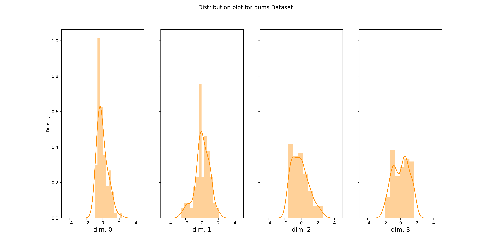
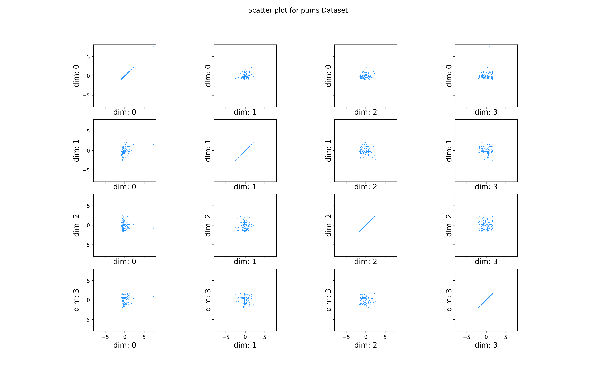
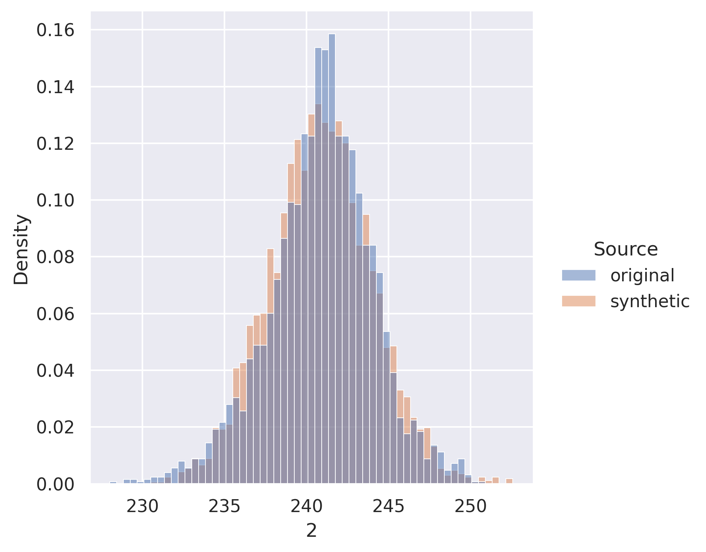
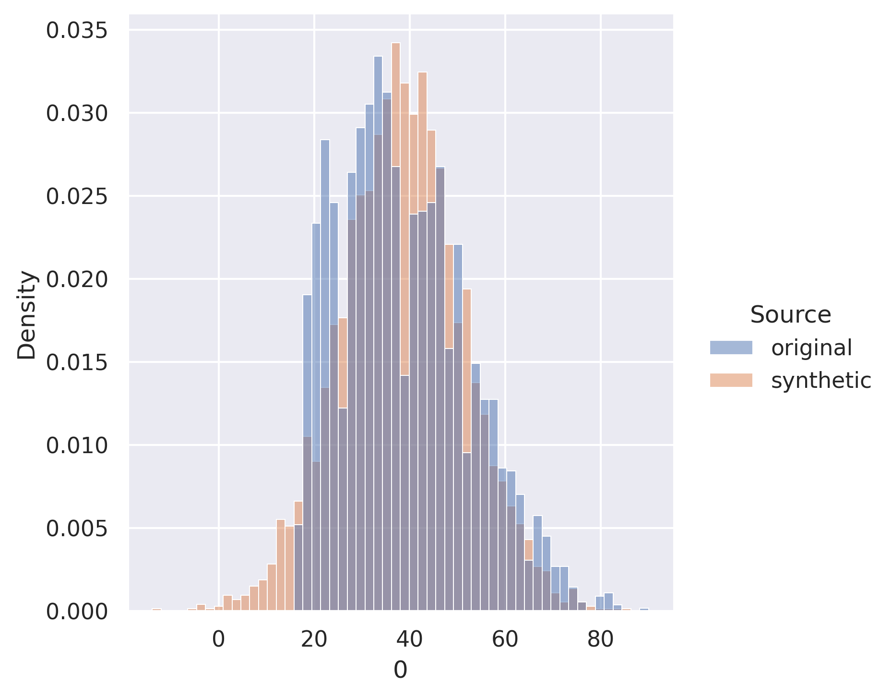
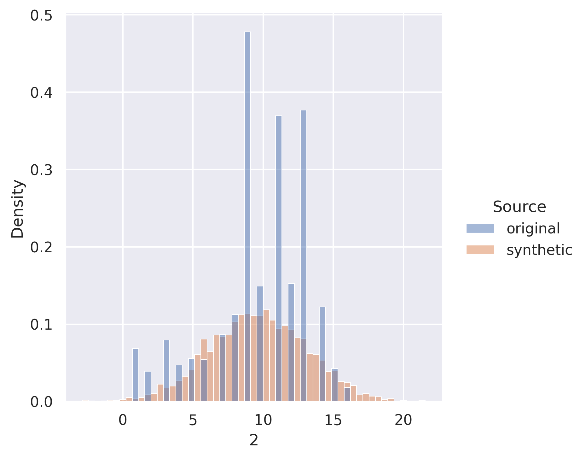

# Differentially Private Synthetic Data Generation Using Normalizing Flows

This repository contains the code and scripts to train models that generate differentially private synthetic data from original datasets containing confidential and/or sensitive data. The model is based on the Masked Autoregressive Flows (MAF) architecture and Differentially Private Stochastic Gradient Descent (DP-SGD). The code is implemented in Pytorch and uses the [Opacus](https://opacus.ai/) library for Differential Privacy.

### System Requirements

All of the scripts are tested to run in [Google Colab](https://colab.research.google.com/), which uses Python 3.7.10 version (with GPU option). We also tested to run locally in Macbook Pro environment with Python 3.7.9 version (CPU option). However, we believe any Python version greater than or equal to 3.6 should work.

#### Install dependencies

```
$ pip install -r requirements.txt
```

### How to run the code

All the codes related to the basic synthesizer can be found in the [basic_synthesizer](./basic_synthesizer) directory. The directory also contains example notebooks that demonstrate how to generate the synthetic datasets and test the performance metrics for the basic synthesizer (eg: [adult dataset example](./basic_synthesizer/adult_sample.ipynb)).

All the scripts to train the Differentially Private Normalizing Flows model are located in the this root directory.
Each of the scripts contain various options to run the code. Please run `python <script>.py --help` to see all the options before running the code.

#### Training the Model

```
$ python train.py
```

#### Generating Diagnostic Plots

```
$ python evaluate_diagnostics.py --model_path <model_file_to_use> --data_name <dataset_name>
```

#### Generating Synthetic Datasets

```
$ python generate_synthetic_dataset.py
```

#### Evaluating Performance Metrics

```
$ python metrics/evaluate.py
```

#### Generating Histogram plots

```
$ python generate_histograms.py
```


### Results & Figures

#### Model Diagnostics

The underlying assumption of our Normalizing Flows model is that the base known density follows a multivariate gaussian distribution. In order to validate whether our model satisfies this assumption, we use our test dataset and backpropagate it through the model to obtain `u` (the base known data). Then we plot the distribution plots and pairwise scatterplots for the `u` obtained for the attributes. We expect the distribution plots to appear normal and the scatterplots should show a uniformly spread circular cluster in the middle.

The diagnostic plots for all the datasets can be found [here](/figs/subset_dp_models/diagnostic_plots).

Distribution Plot for PUMS            |  Pairwise Scatterplots for PUMS
:-------------------------:|:-------------------------:
  |    |


#### Synthetic Data vs Real Data

The side by side histograms betwen synthetic data vs real data is available in the following [directory](/figs/subset_dp_models/histograms_real_vs_synth). All of the columns for the three datasets are available in that directory. Here are some notable columns within all the histograms.
POWER-voltage             |  Adult-age          |  PUMS-education
:-------------------------:|:-------------------------:|:-------------------------:
  |    | 


#### Performance Metrics

From the models trained with differentially private MAF architecture, we have generated synthetic datasets of 4000 rows for each of the three datasets. We have compared the performance of these synthetic datasets on the following 3 metrics: pMSE, SRA and Wasserstein distance. Following two tables presents the performance of datasets from basic synthesizer (no DP) and DP-trained models.

**Basic Synthesizer Performance**
| Dataset | Synthetic Ranking Agreement (SRA) | Wasserstein Ratio | PMSE Ratio |
|--------|-------------|--------|-------------|
| Adult | 1 | 0.147 | 0.999 |
| PUMS | 1 | 0.142 | 0.658 |
| Power | 0.999| 0.143 | 1.140 |

**DP-MAF Model Performance**
| Dataset | Synthetic Ranking Agreement (SRA) | Wasserstein Ratio | PMSE Ratio |
|--------|-------------|--------|-------------|
| Adult | 0.6 | 0.0834 | 1.8946 |
| PUMS | 0.167 | 0.0934 | 0.7844 |
| Power | 0.71| 0.0838 | 0.5838 |

### License
This code is available under the [MIT License](./LICENSE).

### Terms of Use
This code is free to be used by anyone who would like to run DP-MAF experiments. By using the data and source code in this repository, you agree to their respective licenses. 
